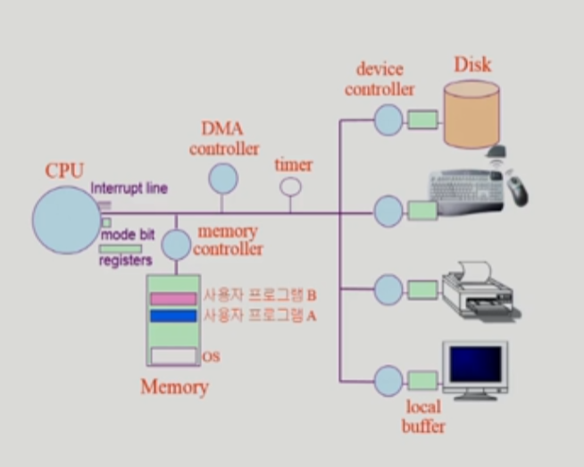
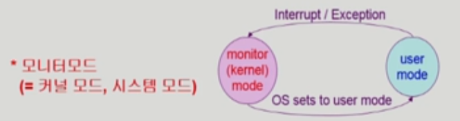

1. Mode bit
- 사용자 프로그램의 잘못된 수행으로 다른 프로그램 및 운영체제에 피해가 가지 않도록 하기 위한 보호 장치
- 1(사용자 모드): 사용자 코드 수행
- 0(모니터 모드): OS 코드 수행 
- Interrupt나 Exception 발생시 하드웨어가 mode bit을 0으로 바꿈
- 사용자 프로그럼에게 CPU를 넘기기 전에 mode bit을 1로 셋팅

2. Timer
- 정해진 시간이 른 뒤 운영체제에게 제어권이 넘어가도록 인터럽트를 발생시킴
- 타이머는 매 클럭 틱 때마다 1씩 감소
- 타이머 값이 0이되면 타이머 인터럽트 발생
- CPU를 특정 프로그램이 독점하는 것으로부터 보호
- 타이머는 time sharing을 구현하기 위해 널리 이용
- 타이머는 현재 시간을 계산하기 위 해서도 사용