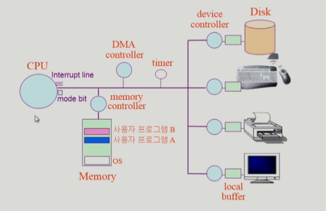
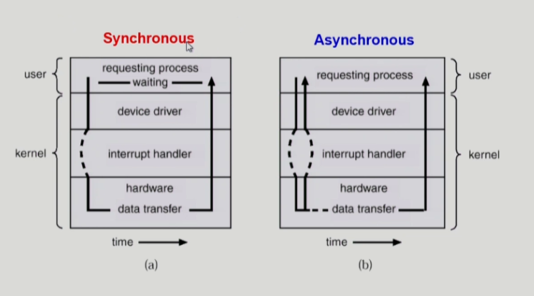
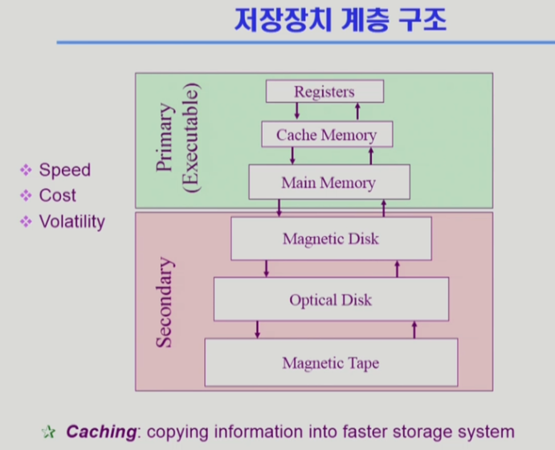
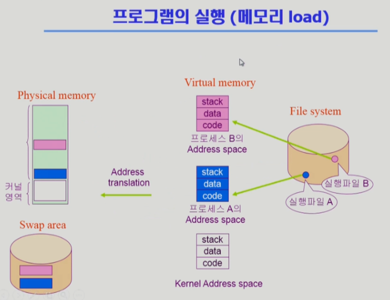
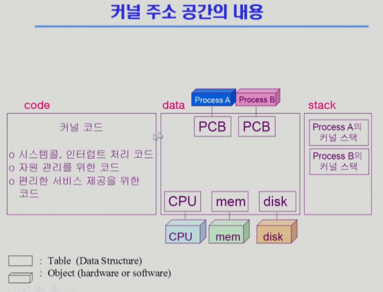

- CPU는 프로그램 카운터라는 register가 가르키는 memory 주소에서 instruction을 읽어서 실행
- Interrupt가 들어 왔는지 체크 -> 운영체제한테 CPU 제어권이 넘어감
- timer가 인터럽트를 걸어주면 사용자 프로그램의 CPU를 뻇어서 운영체제가 얻게됨.

1. 동기식 입출력과 비동기식 입출력
- 동기식 입출력(synchronous I/O)
  - I/O 요청 후 입출력이 작업이 완료된 후에야 제어가 사용자 프로그램에 넘어감
  - 구현방법 1
    - I/O가 끝날 때까지 CPU를 낭비시킴
    - 매시점 하나의 I/O만 일어날 수 있음
  - 구현방법 2
    - I/O가 완료될 때까지 해당 프로그램에게서 CPU를 빼앗음
    - I/O 처리를 기다리는 줄에 그 프로그램을 줄 세움
    - 다른 프로그램에게 CPU를 줌
- 비동기식 입출력(asynchronous I/O)
  - I/O가 시작된 후 입출력이 작업이 끝나기를 기다리지 않고 제어가 사용자 프로그램에 즉시 넘어감

두 경우 모드 I/O의 완료는 인터럽트로 알려줌

2. DMA (Direct Memory Access)
- 빠른 입출력 장치를 메모리에 가까운 속도로 처리하기 위해 사용
- CPU의 중재 없이 device controller가 device의 buffer storage의 내용을 메모리에 block 단위로 직접 전송
- 바이트 단위가 아니라 block 단위로 인터럽트를 발생시킴

3. 저장장치 계층 구조

4. 프로그램의 실행(메모리 load)

5. 커널 주소 공간의 내용

6. 사용자 프로그램이 사용하는 함수
- 사용자 정의함수
  - 자산의 프로그램에서 정의한 함수
- 라이브러리 함수
  - 자신의 프로그램에서 정의하지 않고 갖다 쓴 함수
  - 자신의 프로그램의 실행 파일에 포함되어 있음
- 커널 함수
  - 운영체제의 프로그램 함수
  - 커널 함수의 호출 = 시스템콜