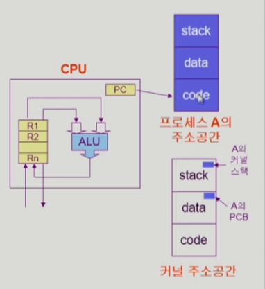
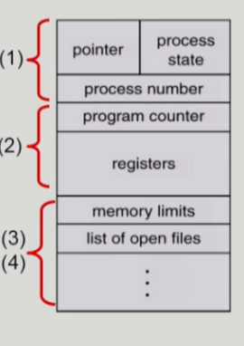
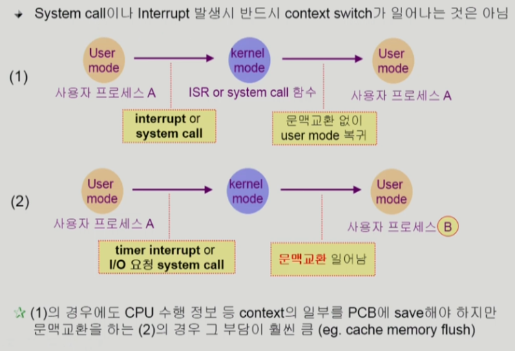
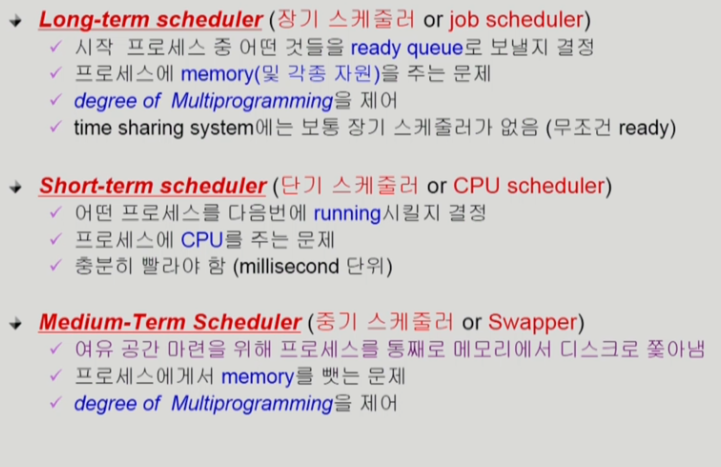

- Process is a progra in execution
- 프로세스의 문맥(context)
  - CPU 수행 상태를 나타내는 하드웨어 문맥
    - Program Counter
    - 각종 register
  - 프로세스의 주소 공간
    - code, data, stack
  - 프로세스 관련 커널 자료 구조
    - PCB(Process Control Block)
    - Kernel stack

- PCB(Process Control Block)
  - 운영체제가 각 프로세스를 관리하기 위해 프로세스당 유지하는 정보
  - 다음의 구성 요소를 가진다(구조체로 유지)
    - (1) OS가 관리상 사용하는 정보
      - Process state, Process ID
      - scheduling information, priority
    - (2) CPU 수행 관련 하드웨어 값
      - Program counter, register
    - (3) 메모리 관련
      - Code, data, stack의 위치 정보
    - (4) 파일 관련
      - Open file descriptors

- Context Switch
  - CPU를 한 프로세스에서 다른 프로세스로 넘겨주는 과정
  - CPU가 다른 프로세스에게 넘어갈 때 운영체제는 다음을 수행
    - CPU를 내어주는 프로세스의 상태를 그 프로세스의 PCB에 저장
    - CPU를 새롭게 얻는 프로세스의 상태를 PCB에서 읽어옴

- Scheduler
