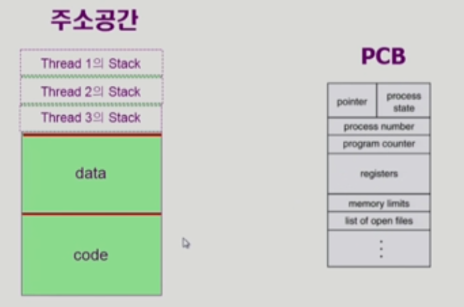
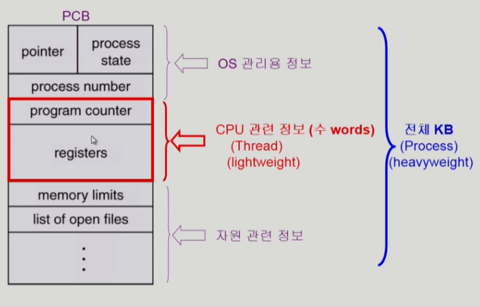
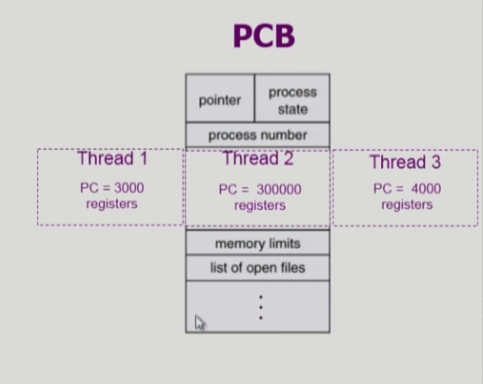

- Thread is a basic unit of CPU utilization
- Thread의 구성
  - program counter
  - register set
  - stack space
- Thread가 동료 thread와 공유하는 부분(=task)
  - code section
  - data section
  - OS resources
- 전통적인 개념의 heavyweight process는 하나의 thread를 가지고 있는 tack로 볼 수 있다

- 프로세스 하나에 CPU 수행 단위만 여러개 두고있는 것을 thread라고 함
- 다중 스레드로 구성된 테스크 구조에서는 하나의 서버 스레드가 bloacked(waiting) 상태인 동안에도 동일한 태스크 내의 다른 스레드가 실행(running)되어 빠른 처리를 할 수 있다
- 동일한 일을 수행하는 다중 스레드가 협력하여 높은 처리율(throughput)과 성능 향상을 얻을 수 있다, 자원절약
- 스레드를 사용하면 병렬성을 높일 수 있다

- 장점
  - Responsiveness
  - Resource Sharing: n threads can share binary code, data, resource of the process
  - Economy: creating & CPU switching thread(rather than a process)
  - Utilization of MP Architecture: each thread may be running in parallel on a different processor

- Kernel Threads, User Threads