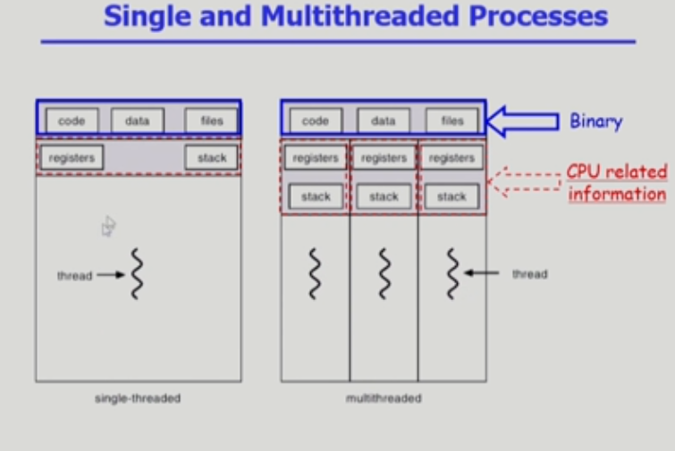

- Thread
  - 다중 스레드로 구성된 태스크 구조에서는 하나의 서버 스레드가 blocked (waiting) 상태인 동안에도 동일한 태스크 내의 다른 스레드가 실행(running)되어 빠른 처리를 할 수 있다
  - 동일한 일을 수행하는 다중 스레드가 협력하여 높은 처리율(throughput)과 성능 향상을 얻을 수 있다
  - 스레드를 사용하면 병렬성을 높일 수 있다
