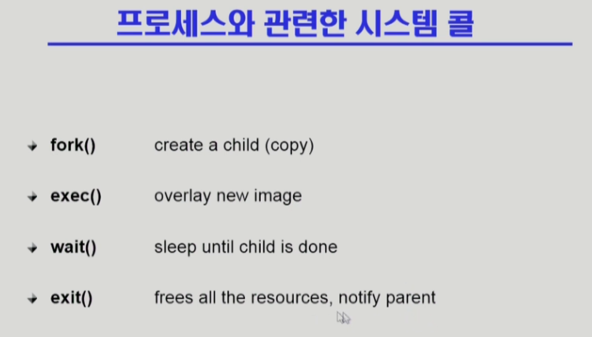
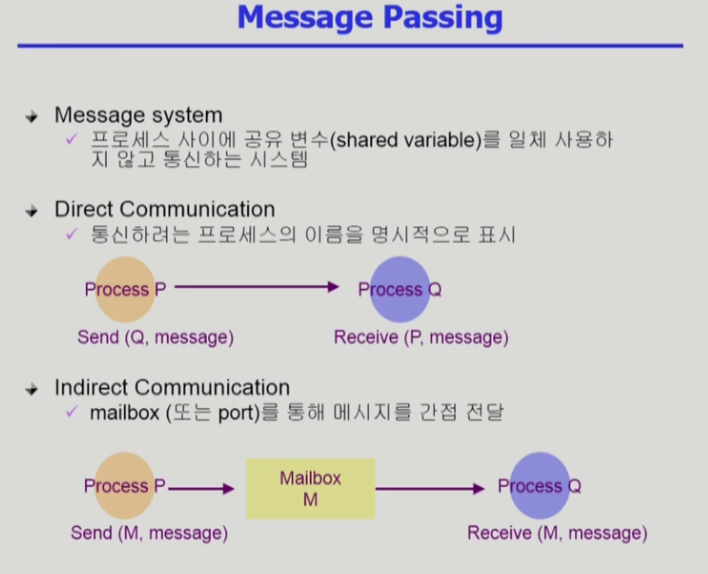
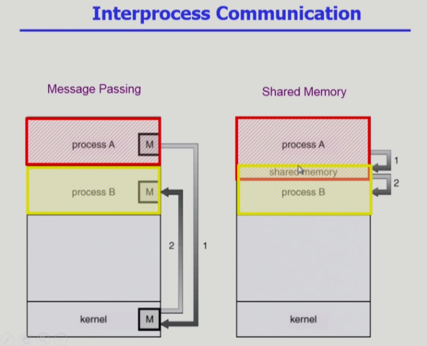

- wait() 시스템 콜
  - 프로세스 A가 wait() 시스템 콜을 호출하면
    - 커널은 child가 종료될 때까지 프로세스 A를 sleep 시킨다 (black 상태)
    - Child process가 종료되면 커널은 프로세스 A를 꺠운다 (ready 상태)

- 리눅스에서 커맨드창에서 python3 ~~를 치면 자식 프로그램 실행 wait 상태
- exit() 시스템 콜
  - 자발적 종료
    - 마지막 statement 수행 후 exit() 시스템콜을 통해 프로그램에 명시적으로 적어주지 않아도 main함수가 리턴되는 위치에 컴파일러가 넣어줌
  - 비자발적 종료
    - 부모 프로세스가 자식 프로세스를 강제 종료시킴
      - 자식 프로세스가 한계치를 넘어서는 자원 요청
      - 자식에게 할당된 태스크가 더 이상 필요하지 않음
    - 키보드로 kill, break등을 친 경우
    - 부모가 종료하는 경우
      - 부모 프로세스가 종료하기 전에 자식들이 먼저 종료됨

- 프로세스 간 협력
  - 독립적 프로세스
    - 프로세스는 각자 주소공간을 가지고 수행되므로 원칙적으로 하나의 프로세스는 다른 프로세스의 수행에 영향을 미치지 못함
  - 협력 프로세스
    - 프로세스 협력 메커니즘을 통해 하나의 프로세스가 다른 프로세스의 수행에 영향을 미칠 수 있음
  - 프로세스 간 협력 메커니즘
    - 메세지를 전달하는 방법
      - message passing: 커널을 통해 메시지 전달
    - 주소 공간을 공유하는 방법
      - shared memory: 서로 다른 프로세스 간에도 일부 주소 공간을 공유하게 하는 shared memory 메커니즘이 있음
      - thread: thread는 사실상 하나의 프로세스이므로 프로세스간 협력으로 보기는 어렵지만 동일한 process를 구성하는 thread들 간에는 주소 공간을 공유하므로 협력이 가능
  
  