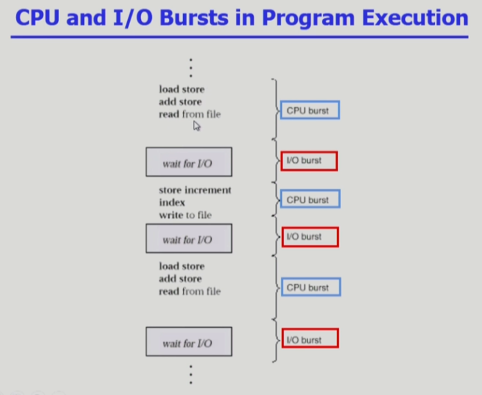
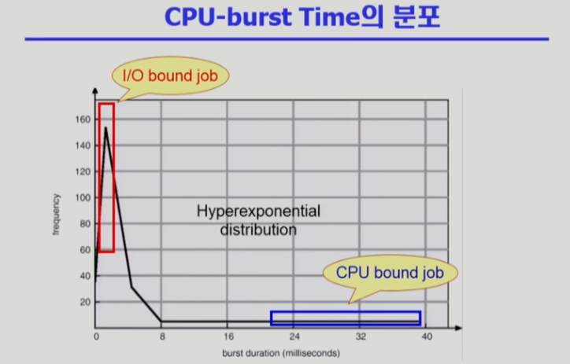
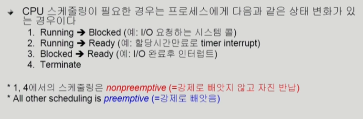

- 여러 종류의 job(=process)이 섞여 있기 때문에 CPU 스케줄링이 필요하다
- interactive job에게 적절한 response 제공 요망
- CPU와 I/O 장치 등 시스템 자원을 골고루 효율적으로 사용
- 프로세스의 특성 분류
  - I/O-boud process
    - CPU를 잡고 계산하는 시간보다 I/O에 많은 시간이 필요한 job
    - many short CPU bursts
  - CPU-bound process
    - 계산 위주의 job
    - few very long CPU bursts

- CPU Scheduler
  - Ready 상태의 프로세스 중에서 이번에 CPU를 줄 프로세스를 고른다
- Dispatcher
  - CPU의 제어권을 CPU scheduler에 의해 선택된 프로세스에게 넘긴다
  - 이 과정을 context switch(문맥 교환)라고 부른다
- 