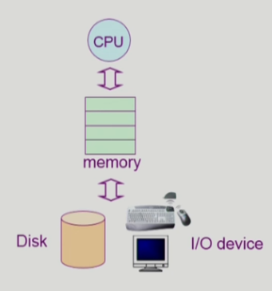

1. 운영체제란? 
- 컴퓨터 하드웨어 바로 위에 설치되어 사용자 및 다른 모든 소프트웨어와 하드웨어를 연결하는 소프트웨어 계층

- 컴퓨터 시스템을 편하게 사용할 수 있는 환경을 제공
  - 운영체제는 동시 사용자/ 프로그램들이 각각 독자적으로 수행되는 것 같은 환상 제공
  - 하드웨어를 직접 다루는 복잡한 부분을 운영체제가 대행
 
  
- 컴퓨터 시스템의 자원을 효율적으로 관리
  - 프로세서, 기억장치, 입출력 장치 등을 효율적으로 관리 
    - 사용자간의 형형성 있는 자원 분배
    - 주어진 자원으로 최대한의 성능을 내도록..

## 운영체제 분류
1. 동시작업 가능 여부
- 단일 작업(single tasking): MS_DOS 프롬프트 상에서는 한 명령의 수행이 끝내기 전에 다른 명령을 수행시킬 수 없음
- 다중 작업(multi tasking): UNIX, MS Window 등에서는 한 명령의 수행이 끝나기 전에 다른 명령이나 프로그램을 수행 할 수 있음

2. 사용자의 수
- 단일 사용자(single user)
- 다중 사용자(multi user)

3. 처리 방식
- 일괄 처리(batch process)
    - 작업 요청의 일정량 모아서 한번에 처리
    - 작업이 완련 종료될 때까지 기다려야 함
- 시분할 (time sharing process)
    - 여러 작업을 수행할 때 컴퓨터 처리 능력을 일정한 시간 단위로 분할하여 사용
    - 일괄 처리 시스템에 비해 짧은 응답 시간을 가짐
    - interactive한 방식
- 실시간 (realtime OS)
    - 정해진 시간 안에 어떠한 일이 반드시 종료됨이 보장되어야 하는 실시간 시스템을 위한 OS
    - ex) 원자로/공장 제어, 미사일 제어, 반도체 장비, 로보트 제어
    - 실시간 시스템의 개념 확장
      - 경성 실시간 시스템(Hard realtime system)
      - 연성 실시간 시스템(Soft realtime system)

- Multitasking
- Multiprogramming: 여러 프로그램이 메모리에 올라가 있음을 강조
- Time Sharing: CPU의 시간을 분할하여 나누어 쓴다는 의미를 강조
- Multiprocess: 
- Multiproessor: 하나의 컴퓨터에 CPU(processor)가 여러개 붙어 있음을 의미

